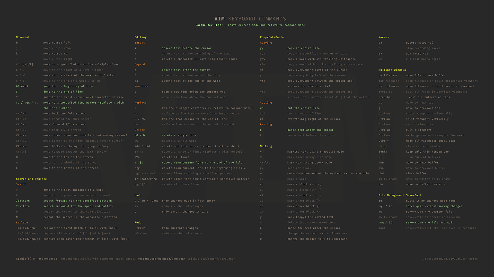

### vim editor related information Including personal preferences, settings and guides

**Contents**

- Wallpaper (Updated 22 August 2020) Custom designed vim keyboard command wallpaper available 1080, 4k and 8k resolution.

## VIM Keyboard Commands Wallpaper  
  

*VIM Wallpaper Download*

| Resolution | Format | Link |
|:-----------|:------|:--------|
| 1920 x 1080 | PNG | [DOWNLOAD](wallpapers/vim_keys_1080.png) |
| 3840 x 2160 (4K) | PNG | [DOWNLOAD](wallpapers/vim_keys_4k.png) |
| 7680 x 4320 (8K) | PNG | [DOWNLOAD](wallpapers/vim_keys_8k.png) |

## Credit(s) & Reference(s)  

- vim wallpaper command key information sourced from man pages and a great guide and cheat sheet available here [phoenixnap.com](https://phoenixnap.com/kb/vim-commands-cheat-sheet)
- Colour scheme inspiration [github.com/morhetz/gruvbox](https://github.com/morhetz/gruvbox)
- Font used **Fira Code** [github.com/tonsky/FiraCode](https://github.com/tonsky/FiraCode)
